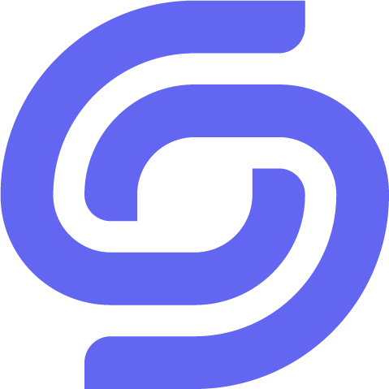
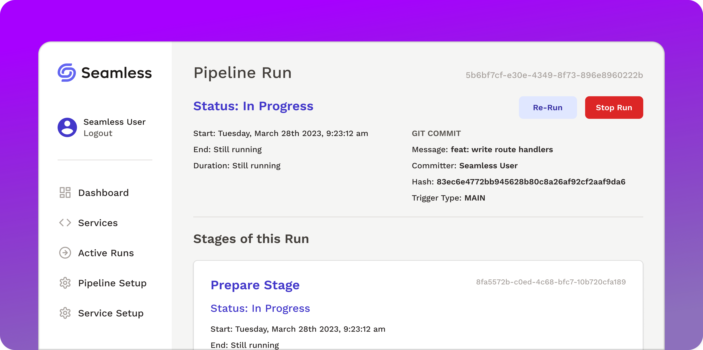

<h1 align="left">👋 Hi, I'm Ethan!</h1>

I'm a software engineer with multiple years of experience in full-stack development in the Javascript and Ruby ecosystems.

My passion for software engineering stems from the excitement I felt when I first started building web applications on my own. I had a ton of fun building these apps, but as their complexity grew, I encountered more bugs and they became harder to maintain. This experience sparked a renewed focus on software engineering fundamentals, and over the past 2 years, I have had an incredible learning experience at Launch School, a mastery-based software engineering curriculum focused on fundamentals.

<h2 align="left">
  
  Seamless
</h2>

Most recently, I worked with a remote team of three to build [Seamless](https://seamless-cicd.com/), an open-source, low-config CI/CD pipeline for containerized microservices. Read our [case study](https://seamless-cicd.com/case-study) or watch our [tech talk](https://www.youtube.com/watch?v=L-WuIpvBv38) for more details!

 
